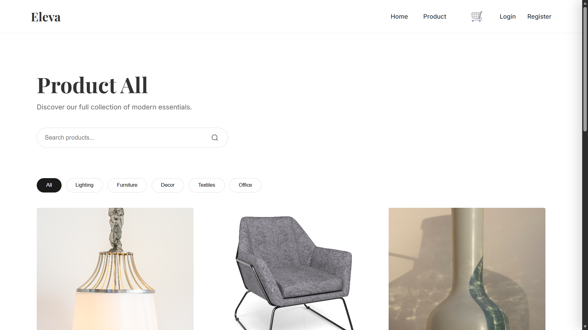
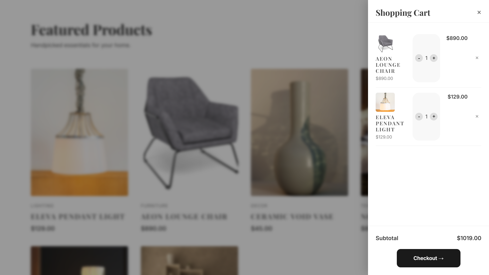
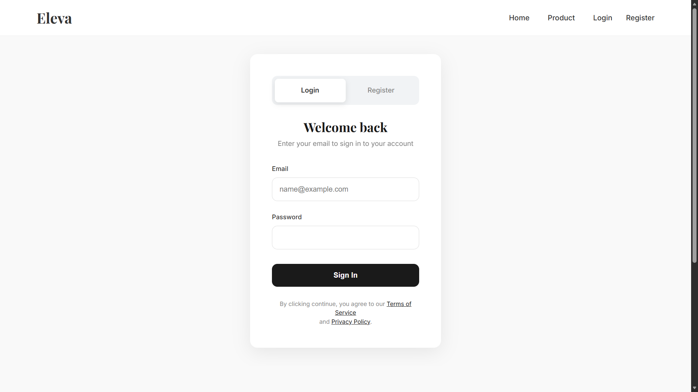

# 🛒 Full Stack E-Commerce Web Application

A functional **Full Stack E-Commerce web application** built using  
**HTML, CSS, JavaScript, Node.js (Express), and MongoDB**.

This project demonstrates core concepts of frontend development, backend APIs,
user authentication, and database integration in a real-world application setup.

---

## 🚀 Features

- User Registration & Login
- Product Listing
- Product Details Page
- Shopping Cart
- Checkout & Order Confirmation
- Order Processing
- MongoDB database for:
  - Users
  - Products
  - Orders

---

## 🧑‍💻 Tech Stack

### Frontend
- HTML5
- CSS3
- JavaScript (Vanilla)

### Backend
- Node.js
- Express.js

### Database
- MongoDB  
- MongoDB Compass

---

## 📸 Screenshots

### Home Page

### Product Details

### Shopping Cart / Checkout

### Login / Register

---

## ⚙️ How to Run Locally

1. Clone the repository
   
   git clone https://github.com/sameerkumar-dev/fullstack-ecommerce-app.git

2. Install dependencies

    npm install

3. Start the server

    node server.js

4. Open in browser

    http://localhost:3000

    
#📚 Learning Highlights

 - Full stack application flow
 - Backend API development
 - MongoDB data handling
 - Authentication basics
 - Practical project structuring

#👤 Author

Sameer Kumar
BCA Student | Full-Stack Learner

🔗 GitHub: https://github.com/sameerkumar-dev
🔗 LinkedIn: https://www.linkedin.com/in/sameer-kumar-it
